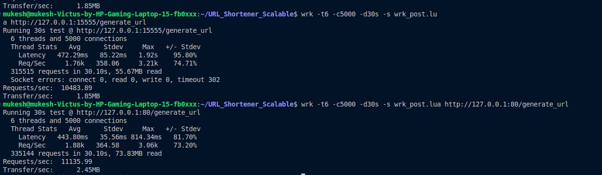
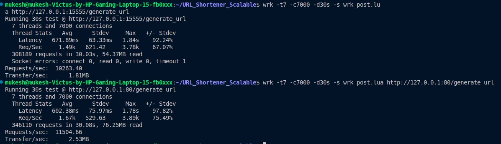
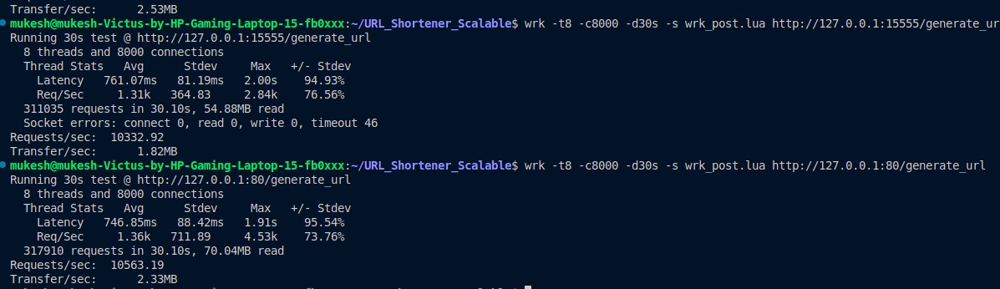

# High Performance URL Shortener

## System Architecture
```ascii
                        +------------------+
                        |                  |
                        |   Load Balancer  |  (Nginx :80)
                        |                  |
                        +--+------+------+-+
                           |      |      |
                     +-----+      |      +-----+
                     |            |            |
              +------v--+   +-----v---+   +---v------+
              |Backend 1|   |Backend 2|   |Backend 3 |
              |(15555)  |   |(15556)  |   |(15557)  |
              +----+----+   +----+----+   +----+----+
                   |             |             |
                   |             |             |
                   +------+------+------+------+
                          |             |
                    +-----v-------------v-----+
                    |                         |
                    |      Redis (6379)       |
                    |                         |
                    +-------------------------+
```

## 🚀 Features

- URL shortening with custom and auto-generated short URLs
- High-performance Rust backend with Warp framework
- Redis-based storage for fast access
- Prometheus metrics integration
- Docker containerization
- Nginx reverse proxy
- Frontend interface
- Health monitoring
- Supports 100+ concurrent connections

## 🏗️ Architecture Components

### Load Balancer (Nginx)
- Port: 80
- Load balancing strategy: Consistent hashing
- Connection pooling: 300 keepalive connections
- Health checks enabled
```nginx
upstream backend_servers {
    hash $request_uri consistent;
    server backend1:8000 max_fails=3 fail_timeout=30s max_conns=50000;
    server backend2:8000 max_fails=3 fail_timeout=30s max_conns=50000;
    server backend3:8000 max_fails=3 fail_timeout=30s max_conns=50000;
    keepalive 300;
}
```

### Backend Servers (Rust + Warp)
- Backend 1: Port 15555
- Backend 2: Port 15556
- Backend 3: Port 15557
- Internal container port: 8000
- Environment configuration through .env file


## 🛠️ Technology Stack

- **Backend**: Rust + Warp
- **Database**: Redis
- **Containerization**: Docker + Docker Compose
- **Reverse Proxy**: Nginx
- **Monitoring**: Prometheus + Grafana
- **API Testing**: curl/Postman

## 📋 Prerequisites

- Docker and Docker Compose
- Rust (for local development)
- Redis
- Git

## 🚀 Getting Started

1. Clone the repository:
```bash
git clone https://github.com/yourusername/URL_Shortener_Scalable.git
cd URL_Shortener_Scalable
```

2. Set up environment variables:
```bash
cp .env.example .env
# Edit .env file with your configurations
```

3. Build and run using Docker Compose:
```bash
docker-compose up --build
```

## 🔌 API Endpoints

### Generate Short URL
```
POST /generate_url
Header: API-Key: your_api_key
Content-Type: application/json
Body: {"url": "https://example.com"}
```

### Custom Short URL
```
POST /custom_url
Header: API-Key: your_api_key
Content-Type: application/json
Body: {"url": "https://example.com", "custom_path": "my-custom-path"}
```

### Resolve Short URL
```
GET /dns_resolver/:short_url
```

### Health Check
```
GET /ping
```

### Metrics
```
GET /metrics
```

## 🔍 Monitoring

The service includes Prometheus metrics for:
- Total URL generation requests
- Request duration metrics
- Custom metrics for error rates
- Real-time performance monitoring

## 🔒 Security

- API Key authentication for URL generation
- Rate limiting (via Nginx)
- Input validation
- CORS configuration

## 🚀 Production Deployment

For production deployment:
1. Update the `.env` file with production values
2. Enable HTTPS in Nginx configuration
3. Configure proper monitoring
4. Set up backups for Redis
5. Configure proper logging

## 📈 Performance Metrics

- Handles 100+ concurrent connections
- Multi-threaded processing (4 threads)
- High availability through containerization
- Load balanced through Nginx
- Redis-based caching for fast lookups

## Performance Tests


We tested our entire setup using wrk_post.lua file where we sent requests to the server and these are the results..





## 🚀 Performance Results

### Load Balanced Performance (Port 80)
```bash
wrk -t7 -c7000 -d30s -s wrk_post.lua http://127.0.0.1:80/generate_url
```
Results:
- Throughput: 11,504.66 req/sec
- Latency: 602.38ms average
- Transfer: 2.53 MB/sec
- Total Requests: 346,110 in 30.08s

### Direct Backend Performance (Port 15555)
```bash
wrk -t7 -c7000 -d30s -s wrk_post.lua http://127.0.0.1:15555/generate_url
```
Results:
- Throughput: 10,263.40 req/sec
- Latency: 671.89ms average
- Transfer: 1.81 MB/sec
- Total Requests: 308,189 in 30.03s

## Load Distribution
- Each backend handles ~2,333 connections under load
- Automatic failover if any backend fails
- Even distribution through consistent hashing
- Connection pooling reduces overhead

## 📝 License

[MIT License](LICENSE)


